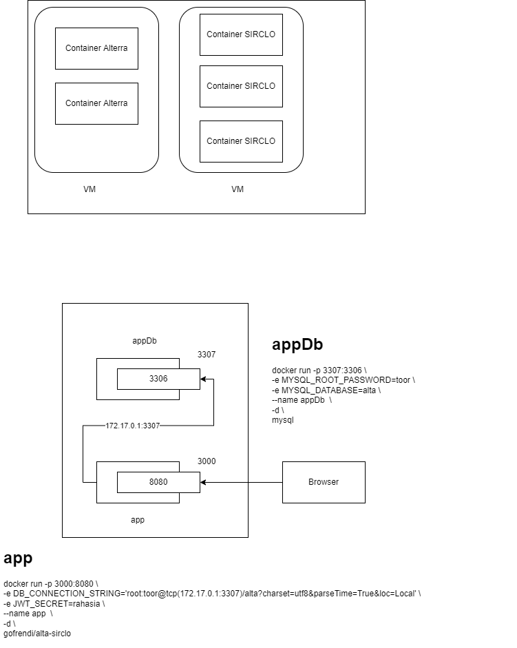

# Howto


## Run the program using environment file

```bash
source template.env
go run main.go
```

## Run the program by using manually set environment

```bash
export DB_CONNECTION_STRING='root:Alch3mist@tcp(127.0.0.1:3306)/db_sirclo_api_gorm?charset=utf8&parseTime=True&loc=Local'
go run main.go
```

# Getting started with docker

Common commands

```bash
# pull image from container registry
docker pull <image-name>

# login to container registry
docker login -u <user-name>

# build image
docker build -t <tag> .

# push image to container registry
docker push <image-name>

# create and run container
docker run -p <host-port>:<container-port> -e <env-name>=<env-value> -v <host-volume>:<container-volume> --name <container-name> <image-name>

# run existing container
docker start <container-name>
docker container start <container-name>

# stop running container
docker stop <container-name>
docker container stop <container-name>

# remove container
docker rm <container-name>
docker container rm <container-name>

# show images
docker image list

# show container
docker container list
docker ps
docker ps -a

# access/run command in a container
docker exec -it <container-name> <command>
docker exec -it mysql bash
```

# Using docker

If you are using docker-desktop, the containers can access host os by using `host.docker.internal` name.

Otherwise, you can use default host IP address: `172.17.0.1`

```bash
# create and run appDb container
docker run -p 3307:3306 \
-e MYSQL_ROOT_PASSWORD=toor \
-e MYSQL_DATABASE=alta \
--name appDb  \
-d \
mysql

# create and run appContainer
docker run -p 3000:8080 \
-e DB_CONNECTION_STRING='root:toor@tcp(172.17.0.1:3307)/alta?charset=utf8&parseTime=True&loc=Local' \
-e JWT_SECRET=rahasia \
--name app  \
-d \
gofrendi/alta-sirclo
```



# Using docker compose

```bash
docker-compose up
docker-compose down
```

When you are using docker-compose, each container can recognize each other's by using their respective service's name.